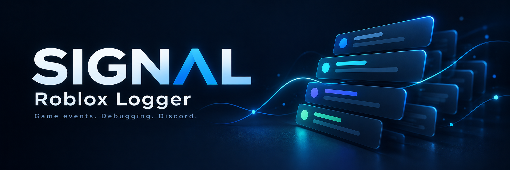

# Signal

A server-side Roblox logger built with Luau. Sends game events and debug messages to Discord.

## Features

- Player joins, leaves, spawns, and deaths
- Server startup, shutdown, and script errors
- Custom debug, info, warning, and error logs
- Batched Discord embeds with retry and rate-limit handling
- Server Output logging

## Setup

1. Download and insert `Signal.rbxmx` into `ServerScriptService`.
2. Open the `Config` ModuleScript and paste your full Discord webhook URL:

```lua
WebhookUrl = "YOUR_WEBHOOK_URL",
StudioDelivery = true,
```

3. Enable **Allow HTTP Requests** in **Experience Settings → Security**.
4. Start a new test session. Logs should appear in Discord within a few seconds.

Keep the `Signal` folder in `ServerScriptService`. Remove your webhook URL before uploading configured scripts to GitHub.

## Usage

Call the logger from a server Script:

```lua
local logger = require(game.ServerScriptService.Signal.Logger).Get()

logger:Info("round.start", "Round started", { map = "Harbor" })
logger:Warn("inventory.reject", "Invalid item rejected", { itemId = "sword_01" })
logger:Error("save.failed", "Data save failed", { attempt = 3 })
```

Set `MinLevel = "DEBUG"` to include debug messages:

```lua
logger:Debug("round.timer", "Timer updated", { seconds = 30 })
```

## Notes

Custom gameplay events need explicit logging calls. Client errors and chat are not captured. Delivery is best effort; queued events can be lost when a server closes or the queue fills up.

If direct Discord delivery returns HTTP 403, check webhook access or use the optional [self-hosted relay](relay/README.md).

[Configuration and tests](docs/advanced.md)
